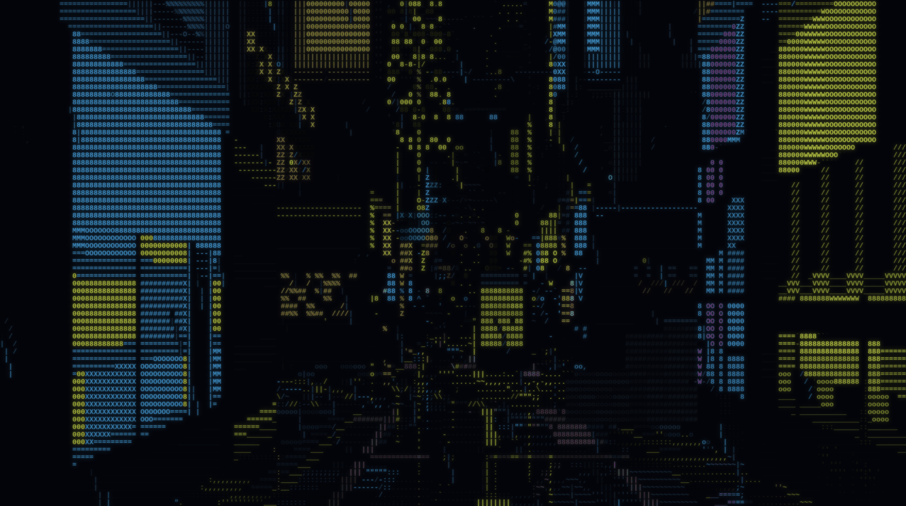
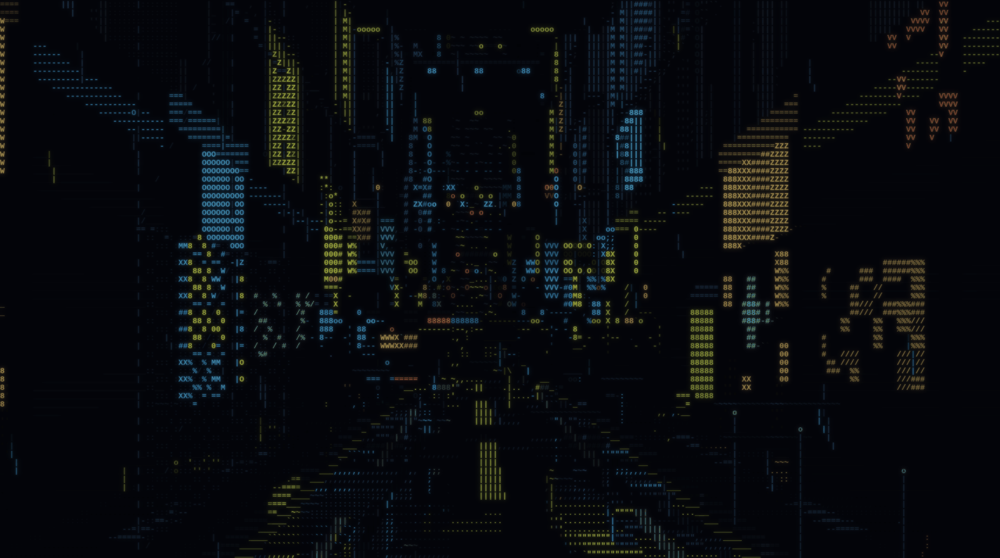
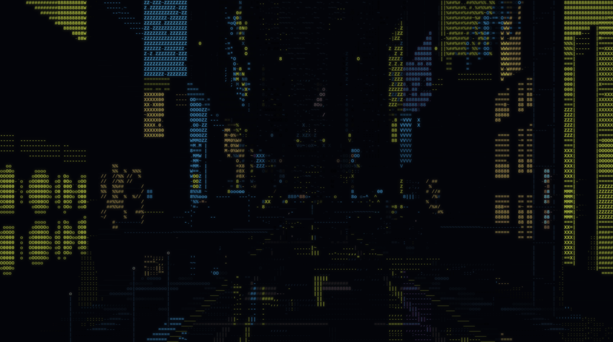
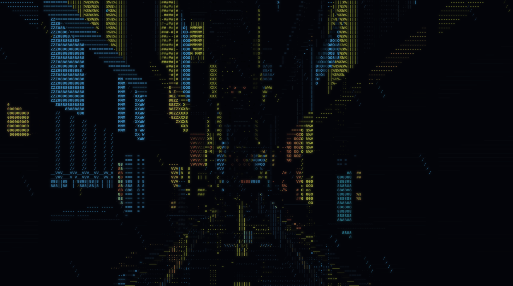

# CyberCity

A walkable cyberpunk city drawn entirely in text characters, in one self-contained HTML file.

No build step to run it, no dependencies, no network requests. Open `index.html` and you are
standing on a street at night in the rain.

**[cybercity.carino.systems](https://cybercity.carino.systems)**



Every cell you see is a character. There is no bitmap anywhere in the renderer — the towers, the
rain, the wet road, the people on the pavement and the traffic lights are all `8`, `%`, `M`, `|`
and `.` in twelve colours.

## What is in it

It walks itself. Leave it alone and it strolls the city forever, turning corners, passing under
signage, waiting at junctions while the weather changes around it. Take the controls whenever you
like and it hands them over; stop steering and it picks the walk back up from wherever you left it.



- **The city** is generated from a seed. Avenues, cross streets, districts with their own colour
  and character, blocks with setbacks and alleys and plazas that open the sky back up.
- **The street** has kerbs, crossings, drain grates, expansion joints, standing water that mirrors
  whatever is above it, and puddles placed on a world lattice so they hold still as you pass them.
- **People**, in twelve costume archetypes with their own silhouettes and their own walks — coats,
  hoods, couriers, umbrellas, visors, a broad one, a slow one with a stick. They stand outside the
  lit shops rather than spreading evenly down a dead block, they cross the road, they shelter when
  it rains, and some of them walk in pairs.
- **Traffic** across the junctions, **aerial traffic** in lanes over the rooftops, **police** cars
  and officers on foot, and a cat.
- **Shops** with types you can tell apart — a laundry is a row of round doors, a noodle counter is
  a lit bar with stools, a bar is dim and warm. Market stalls, kiosks, vending banks.
- **Signage** at two scales: shopfront neon, and advertising several storeys tall.
- **Weather** that changes on its own between six states, and takes the whole city with it — the
  rain, the road, the fog, the umbrellas going up, the crowd thinning out.



## Controls

It plays itself, so all of this is optional.

| | |
|---|---|
| `W` `A` `S` `D` | walk |
| mouse drag | look |
| arrow keys | look, without the mouse |
| `Shift` | run |
| `C` | crouch |
| scroll wheel | zoom |
| `Tab` | take the controls / give them back |
| `Esc` | give them back |
| `P` | photo mode — freezes the city, you can still look and move |
| `1`–`6` | weather: clear, drizzle, rain, downpour, mist, storm |
| `[` `]` | cycle weather |
| `N` | new city |
| `F` | fullscreen |
| `H` | show the controls |

On a phone or tablet the left half of the screen walks, the right half looks, and a tap goes
fullscreen. Gamepads work too.

The URL carries the seed — `#seed=42` — so a city you liked is a link you can send.



## Accessibility

Nothing in this flashes above 3 Hz. That is a hard rule and it is verified rather than asserted:
`tools/flicker-rate.cjs` walks every element that modulates over time, under all six weather
states, and measures the per-cell luminance step and its rate. `tools/lightning-rate.cjs` does the
same for storm lightning specifically. Both have to pass before anything ships.

`prefers-reduced-motion` is honoured throughout. With it on, the walk slows, the rain calms, the
police lightbar holds steady instead of alternating, and the aerial traffic parks — but the city
stays populated. The point is stillness, not deletion.

## Running it

Open `index.html`. That is the whole thing.

To rebuild it from `src/`:

```
node build.js
```

`index.html` is generated — don't edit it by hand. `build.js` concatenates the modules in
`src/`, strips the CommonJS tails that exist only so the offline tools can `require` the same
files, and writes one file. There is no bundler and no minifier: the source stays readable in
View Source, which is half the point of shipping it as a single file.

## How it draws

One column of the screen at a time. For each screen column it marches out through the city
heightmap front to back, keeping a running silhouette row, and paints whatever the ray hits. That
one loop gives occlusion, the rooftop silhouette against the sky, and the sky slot between the
buildings, all for free and all at character resolution.

Everything after that — rain, people, signage, cars, optics — is an *element*: a small module with
`init`, `update` and `draw`, drawn in layer order onto the same character buffer, depth-tested
against the world so a walker goes behind a lamp post. There are 42 of them.

The last stage is a print. Each of the twelve colours has its own exposure weight, then a gamma
lift, a knee and a shoulder rolloff, bucketed by distance. It is the difference between a frame
that is technically correct and one that reads as a photograph of a dark street, and most of the
tuning in this repo is about it.

## Tools

Everything here runs without a browser, which is how the thing gets verified at all.

| | |
|---|---|
| `tools/headless.cjs` | render any frame of any seed offline, as a text dump |
| `tools/topng.py` | turn that dump into a PNG, with the bloom the canvas applies |
| `tools/metrics.py` | the print census — exposure bands, colour split, what each layer costs |
| `tools/peds.cjs` | the crowd alone, against an empty frame, at a size you can actually see |
| `tools/flicker-rate.cjs` | the photosensitivity gate |
| `tools/lightning-rate.cjs` | the same, for storms |
| `tools/domshim.cjs` | runs the built page against a fake DOM — boot, resize, input, tab loss |

The renderer is deterministic: the same seed and frame give a byte-identical picture in a browser
and in `headless.cjs`, which is what makes any of the above worth running.

## A note on the screenshots

They are rendered with `tools/headless.cjs` and `tools/topng.py`, not captured from a browser
window. The frames are the real output of the real renderer at 213×67 cells, and `topng.py`
applies the same bloom the canvas does — but the font is Liberation Mono rather than whatever your
browser picks, so the shapes of individual characters will differ slightly from what you get on
screen.
