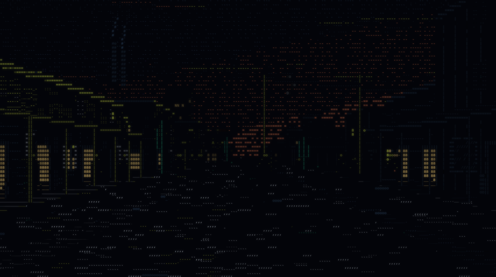
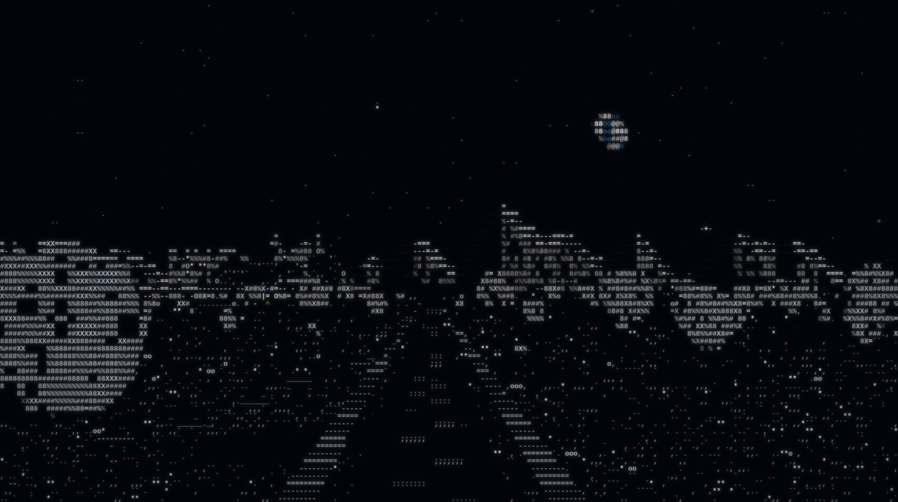
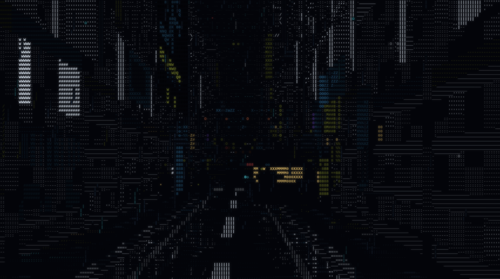
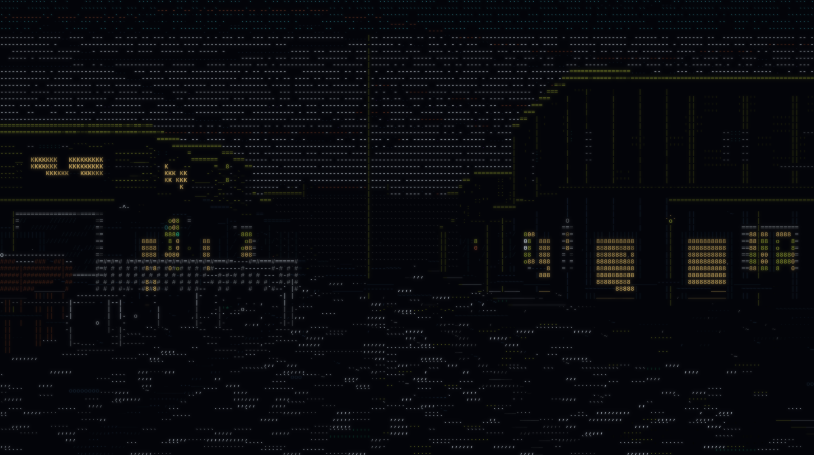

# CyberCity

Three walkable worlds drawn entirely in text characters, in one self-contained HTML file, with the
sun going round.

No build step to run it, no dependencies, no network requests. Open `index.html` and you are
standing on a street in the rain. Press **2** and you are on a dirt road on the frontier; press
**3** and you are on the Moon.

**[cybercity.carino.systems](https://cybercity.carino.systems)**


## Three worlds

| key | world | |
|---|---|---|
| `1` | **CyberCity** | a rain-lit city — neon, aerial traffic, police, market stalls |
| `2` | **Frontier** | an 1880s timber town — veranda posts, painted boards, telegraph, horses, open desert |
| `3` | **Moonwalk** | an Apollo-era lunar surface — regolith, craters, a black sky with Earth in it |

They are the same engine and the same seed. `#42` is a place in all three, so pressing 1, 2 and 3
in turn shows you the same corner of the same street lattice with a different century — or a
different world — built on it. That is the point of having three.





## The day

Every world runs a day/night cycle. Seven minutes is a full day; the sun climbs to 54 degrees and
its bearing swings from east to west, so the shadows swing across the street with it and which side
of the road is lit changes as the morning turns into the afternoon. Lamps come on at dusk and are
still burning after dawn. `T` steps the clock through its six stops — night, dawn, morning, noon,
afternoon, dusk — and `Y` stops and restarts the automatic cycle.

That was not a free feature, and the reason is worth stating: the whole print pipeline is fitted to
a frame that is more than half pure black with a thin scatter of bright glyphs, and daylight is the
inverse of that picture. It is answered with a **second exposure ladder**. By day the two night
pillars go out — a sodium lamp at noon is a grey tube and a screen is a dark rectangle — and white
and slate take the top of the table, because in daylight the bright things are surfaces rather than
sources. The two ladders are blended by the clock and the lookup table is rebuilt when the blend
crosses one of 32 steps, about once every thirteen seconds.

So a city at noon is a grey concrete canyon with dark glass in it under a bright sky, which is what
a city at noon is; and the frontier at noon is a pale road under a deep blue dome. Neither is the
night frame with the brightness turned up.



An honest note on the numbers: `tools/metrics.py` prints a "muddy" census — the share of the frame
in the middle of the print's range — with a target under 30%, and a daylight frame does not meet
it. It cannot: that target describes a night picture, where the middle of the range is haze to be
crushed, and in daylight the middle of the range is where a lit wall, a road and a blue sky all
live. Measured at 200x60, seed 42: the city runs 32% at night, 56% at dusk and 64% at noon; the frontier
36% / 34% / 26%; and Moonwalk **2.8% / 1.8% / 1.3%**. The Moon can hold the night target at every
hour of its day because it has no air, which is the whole argument for it being the third world.

The other number in that census is the hot tail — the share above the print's highlight line, with
a 3.5-5% target — and it moves the other way: the city is 8.0% at night and 3.2% at noon, the
frontier 0.6% at dusk and 5.6% at noon, Moonwalk 3.5% at night and 6.6% at noon. Twilight in the
two atmospheric worlds is the flattest hour of the three, and that is not a bug to be tuned out:
it is the hour when the neon and the sky are the same brightness, which is exactly what makes it
look like twilight.



Every cell you see is a character. There is no bitmap anywhere in the renderer — the towers, the
rain, the wet road, the people on the pavement and the traffic lights are all `8`, `%`, `M`, `|`
and `.` in twelve colours.

## What is in it

It walks itself. Leave it alone and it strolls the city forever, turning corners, passing under
signage, waiting at junctions while the weather changes around it. Take the controls whenever you
like and it hands them over; stop steering and it picks the walk back up from wherever you left it.


- **The city** is generated from a seed. Avenues, cross streets, districts with their own colour
  and character, blocks with setbacks and alleys and plazas that open the sky back up.
- **The street** has kerbs, crossings, drain grates, expansion joints, standing water that mirrors
  whatever is above it, and puddles placed on a world lattice so they hold still as you pass them.
- **People**, in twelve costume archetypes with their own silhouettes and their own walks — coats,
  hoods, couriers, umbrellas, visors, a broad one, a slow one with a stick. They stand outside the
  lit shops rather than spreading evenly down a dead block, they cross the road, they shelter when
  it rains, and some of them walk in pairs.
- **Traffic** across the junctions, **aerial traffic** in lanes over the rooftops, **police** cars
  and officers on foot, and a cat.
- **Shops** with types you can tell apart — a laundry is a row of round doors, a noodle counter is
  a lit bar with stools, a bar is dim and warm. Market stalls, kiosks, vending banks.
- **Signage** at two scales: shopfront neon, and advertising several storeys tall.
- **Weather** that changes on its own between six states, and takes the whole city with it — the
  rain, the road, the fog, the umbrellas going up, the crowd thinning out.


## What is in Moonwalk

The Moon is the world this renderer was waiting for, and that is not a flourish — it is why the
third world is the Moon and not, say, a jungle. The art direction is a frame that is more than half
pure black with a thin scatter of very bright glyphs, and every other world has to be composed to
deliver that. The Moon delivers it by having no air: a shadow with nothing to fill it is genuinely
lum 0, a sunlit surface under an unfiltered sun is genuinely the brightest thing there is, and the
sky is the same absolute black at noon as at midnight. Measured, a lunar frame prints **2.5% of its
cells in the muddy band** against the project's under-30% target and the city's 32%.

- **The ground** is an open regolith plain: the street lattice is still there and is made invisible
  — the pitch nearly doubles, the corridors double again and the blocks go 90% vacant — so the walk
  still has somewhere to walk and you cannot see why.
- **Craters.** The one piece of geometry in any world whose height is a function of position
  *inside* a lot: a flat walkable floor with a raised rim round it on a sine profile, so the route
  can cross a crater rather than being fenced out of one.
- **Terrain types instead of colour masses** — mare, ejecta, rim, highland, landing site, plain —
  with boulder and crater rates rather than window-lighting rates. There are no signs anywhere,
  and that is switched off by *data*: every district has `signP: 0`, so the signage path is never
  entered and no neon blade sign can appear on a crater rim.
- **A hard terminator.** No penumbra and no fill, so the sun response is a step where the other
  worlds use a ramp, and an unlit face past 25 m is a true blank that reads only by its razor edge
  against the lit one beside it.
- **Earth**, hanging in the black and never moving, because the Moon is tidally locked.

## What is in the frontier

The same machinery, told to be somewhere else. The street lattice, the walk, the weather director,
the crowd, the cat and every optic are shared; the map generator, the texture layer, the weather
table and about a third of the elements are the frontier's own.

- **The town** is timber. False fronts — a flat board wall carried a metre and a half above the
  building's own roofline so it looks bigger from the street — clapboard, board-and-batten, adobe
  and fieldstone, in six quarters from the main street to the mission.
- **Open range.** A quarter of the ground is a district that is mostly not a district: empty lots,
  sagebrush, saguaro, and one lot in fourteen carrying a flat-topped sandstone butte.
- **The light.** One low sun in a fixed direction, and every wall in the world is either rimmed in
  amber or a silhouette. Which side of the street is lit changes when the walk turns a corner.
- **The sky.** It is a third of the frame out here, so it is the subject: a banded dusk gradient,
  the sun with its halo, altocumulus bars lit orange along their undersides, the earth-shadow band
  rising in the east, and three vultures on a thermal.
- **The street.** Boardwalks with a step down to the dirt, veranda posts every two and a half
  metres, awnings, porch lanterns, hitching rails, water troughs, barrels, wagon ruts that hold the
  water after a squall.
- **The telegraph**, on one side of the road, with the wire sagging between the poles.
- **Chimneys with smoke, water tanks on legs, bell towers and windmills** on the rooflines.
- **One tumbleweed**, rolling and bouncing, coming off the wind.
- **Weather** out here is a drought broken by a storm: blazing, breeze, dust, squall, overcast,
  thunder.
- **Desert.** Blowing dust that thickens into a sheet under the dust presets, a far skyline of
  mesas and buttes drawn past the fog distance as a pure function of bearing, yucca, mesquite and
  ocotillo alongside the sage and saguaro, and dry washes on the flat.
- **Horses at the hitching rails** — placed on the same lattice the rails are, so they line up —
  wagons crossing the junctions, and a dog.

The frontier also had a de-cyberpunking pass, because it needed one. The crowd is shared with the
city and only its silhouettes had been re-weighted, so 18% of an 1880s town was carrying a glowing
phone, one in ten wore a lit HUD visor, some had electroluminescent piping down the coat, and a
fifth of everybody was rim-lit in screenlight blue. The city's moon element was drawing itself and
a cyan halo straight over the sunset because it won the depth test against the frontier's own sun,
and four hundred stars — the brightest of them in the neon-cyan swatch — were being painted over a
sky with the sun still visibly above the horizon. All of that is gone: the sci-fi costume fields
are gated, the night sky is driven by the clock so it fades out properly at dawn, and no surface in
that world takes azure, violet or ice any more.

## Controls

It plays itself, so all of this is optional.

| | |
|---|---|
| `W` `A` `S` `D` | walk |
| mouse drag | look |
| arrow keys | look, without the mouse |
| `Shift` | run |
| `C` | crouch |
| scroll wheel | zoom |
| `Tab` | take the controls / give them back |
| `Esc` | give them back |
| `P` | photo mode — freezes the world, you can still look and move |
| `1` `2` `3` | world: CyberCity, Frontier, Moonwalk (gamepad: `Y` / triangle cycles) |
| `T` | step the time of day (`Shift`+`T` steps back) |
| `Y` | stop / restart the automatic day cycle |
| `Shift`+`1`–`6` | weather |
| `[` `]` | cycle weather |
| `N` | new seed |
| `F` | fullscreen |
| `H` | show the controls |

The weather presets are `clear, drizzle, rain, downpour, mist, storm` in the city,
`blazing, breeze, dust, squall, overcast, thunder` on the frontier, and on the Moon exactly one,
`vacuum`, with every parameter at zero — which is not a placeholder but the honest answer, and it
is what makes the whole weather machinery collapse to nothing there without a single special case. They moved onto `Shift` when
the worlds took the digit row: which world you are standing in is the larger fact, and it is the
one a viewer told "press 1 or 2" reaches for.

On a phone or tablet the left half of the screen walks, the right half looks, and a tap goes
fullscreen. There is no world gesture: every gesture on a touchscreen is already spoken for by
those two halves, and a hidden two-finger something that rebuilds the world is a trap rather than
a control — so on a phone the second world is reached by its URL, `#west/42`.

Gamepads work too, and a pad is the one input device other than a keyboard that can reach the
second world: **Y** (triangle) cycles it.

The URL carries the world and the seed — `#42` for a city, `#west/42` or `#moon/42` for the same
seed elsewhere — so a place you liked is a link you can send. The bare `#seed=42` form still works,
and so do the words people actually type: `#western/42`, `#lunar/42`, `#apollo/42`.


## Accessibility

Nothing in this flashes above 3 Hz. That is a hard rule and it is verified rather than asserted:
`tools/flicker-rate.cjs` walks every element that modulates over time, under all six weather
states, and measures the per-cell luminance step and its rate. `tools/lightning-rate.cjs` does the
same for storm lightning specifically. `tools/west-flicker.cjs` does it for every world that is not the
city, with the camera pinned so nothing in the frame can change except time, in every one of that
world's weather states. All three have to pass before anything ships.

A word on how to run it: under two seconds of measured window the 3-20 Hz figure is noise, and the
tool now says so. The same tree measured 10.6% in-band at one second and 2.65% at three; only the
second number means anything, and believing the first cost twenty minutes.

The frontier's gate found two real hazards and both were redesigned rather than tuned down. The
windmill was eight dark spokes chopping a bright sky at 4.7 big steps a second against a limit of
1 — it is now a static rim with one bright vane travelling round it, because no rotation rate low
enough to be safe still reads as a turning wheel. The chimney smoke was five discrete dark puffs
crossing the sunset; it is now a continuous plume, drawn far paler, so the cells it occupies stay
occupied and only the sway moves them. After both, the frontier's own elements step at 1.7 times a
second against the city's own 7.7, and carry 2.6% of full scale in the 3-20 Hz band against the
city's 6.5%. The tumbleweed's roll rate and the cloud bars' drift were sized against the same rule
in advance, with the arithmetic written down next to the constant.

`prefers-reduced-motion` is honoured throughout. With it on, the walk slows, the rain calms, the
police lightbar holds steady instead of alternating, the aerial traffic parks, the windmill's vane
stops and the tumbleweed slows to a third — but both worlds stay populated. The point is stillness,
not deletion. Measured: with the flag on, the frontier's own elements produce **no** step over a
third of full scale anywhere and an empty 3-20 Hz band, in every weather state.

## Running it

Open `index.html`. That is the whole thing.

To rebuild it from `src/`:

```
node build.js
```

`index.html` is generated — don't edit it by hand. `build.js` concatenates the modules in
`src/`, strips the CommonJS tails that exist only so the offline tools can `require` the same
files, and writes one file. There is no bundler and no minifier: the source stays readable in
View Source, which is half the point of shipping it as a single file.

## How it draws

One column of the screen at a time. For each screen column it marches out through the city
heightmap front to back, keeping a running silhouette row, and paints whatever the ray hits. That
one loop gives occlusion, the rooftop silhouette against the sky, and the sky slot between the
buildings, all for free and all at character resolution.

Everything after that — rain, people, signage, cars, optics — is an *element*: a small module with
`init`, `update` and `draw`, drawn in layer order onto the same character buffer, depth-tested
against the world so a walker goes behind a lamp post. There are 51 of them. Each one belongs to
one world or to both — an element carries `world: 'cyber'` or `world: 'west'` on itself and
`main.js` filters the list on a rebuild, so the city gets 42 and the frontier gets 26.

The last stage is a print. Each of the twelve colours has its own exposure weight, then a gamma
lift, a knee and a shoulder rolloff, bucketed by distance. It is the difference between a frame
that is technically correct and one that reads as a photograph of a dark street, and most of the
tuning in this repo is about it.

## Tools

Everything here runs without a browser, which is how the thing gets verified at all.

| | |
|---|---|
| `tools/headless.cjs` | render any frame of any seed offline, as a text dump — `--west` / `--moon`, `--time=`, `--weather=`, `--yaw=` |
| `tools/topng.py` | turn that dump into a PNG, with the bloom the canvas applies |
| `tools/metrics.py` | the print census — exposure bands, colour split, what each layer costs |
| `tools/peds.cjs` | the crowd alone, against an empty frame, at a size you can actually see |
| `tools/flicker-rate.cjs` | the photosensitivity gate, for the city's signage |
| `tools/lightning-rate.cjs` | the same, for storms |
| `tools/west-flicker.cjs` | the same, for every world that is not the city — pinned camera, per cell, against the city as its baseline |
| `tools/domshim.cjs` | runs the built page against a fake DOM — boot, resize, input, worlds, tab loss |

The renderer is deterministic: the same seed and frame give a byte-identical picture in a browser
and in `headless.cjs`, which is what makes any of the above worth running.

## A note on the screenshots

They are rendered with `tools/headless.cjs` and `tools/topng.py`, not captured from a browser
window. The frames are the real output of the real renderer at 213×67 cells, and `topng.py`
applies the same bloom the canvas does — but the font is Liberation Mono rather than whatever your
browser picks, so the shapes of individual characters will differ slightly from what you get on
screen.
