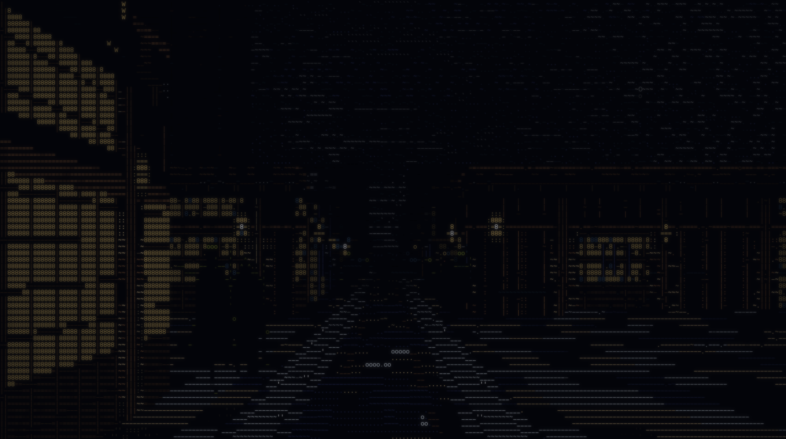
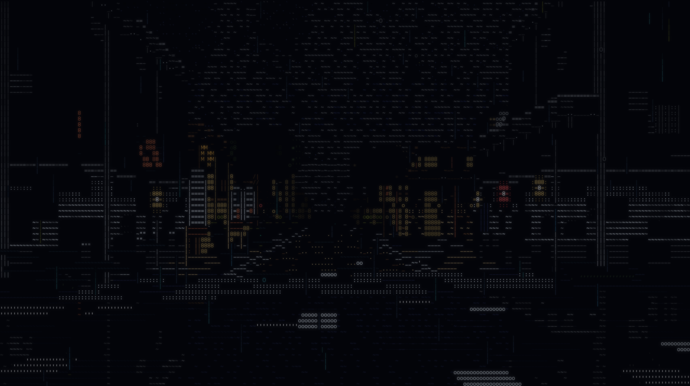

# CyberCity

Four walkable worlds drawn entirely in text characters, in one self-contained HTML file, with the
sun going round.

No build step to run it, no dependencies, no network requests. Open `index.html` and you are
standing on a street in the rain. Press **2** and you are on a dirt road on the frontier; press
**3** and you are on the Moon; press **4** and you are in a castle town on a wet evening.

**[cybercity.carino.systems](https://cybercity.carino.systems)**


## Four worlds

| key | world | |
|---|---|---|
| `1` | **CyberCity** | a rain-lit city — neon, aerial traffic, police, market stalls |
| `2` | **Frontier** | an 1880s timber town — veranda posts, painted boards, telegraph, horses, open desert |
| `3` | **Moonwalk** | an Apollo-era lunar surface — regolith, craters, a black sky with Earth in it |
| `4` | **Edo** | a castle town in the rain — paper screens, lanterns, tiled eaves, a canal, bridges, sakura |

They are the same engine and the same seed. `#42` is a place in all four, so pressing 1, 2, 3 and 4
in turn shows you the same corner of the same street lattice with a different century — or a
different world — built on it. That is the point of having four.




The fourth one is the odd one out and deliberately so. The first three are all lit from a long way
off — by a sodium grid, by one low sun, by another one with no air in front of it — and **Edo** is
lit from inside the street: a paper lantern hung under the eave at 2.1 m and an oil lamp behind
every shopfront. That inverts the whole model. Sun and sky light the top of a wall and leave the
ground dark; lanterns do the opposite, so a machi street after dark is bright at the bottom and
black at the top, and which of the two lighting models the frame is under is what the clock
decides. It is also the only world *built around* an overcast sky rather than merely having one as
a weather state — under a deck there is no shadow to speak of and the two sides of a street are
within a stop of each other, so what carries the picture is not tone but
**lines**: the ridge tile, the drip edge under it, the mid-rail, the gutter, the batter of a castle
wall. A cell of that world is a line or it is nearly nothing.



It also has a **canal** in it — 9.2 m of water on a 160 m pitch, so the walk meets one about every
hundred seconds and crosses it on an arched taiko-bashi. Nothing is carved to make it: in this
engine a negative height renders byte-identically to zero (the march is `if (h <= 0) continue` and
the floor is painted by inverse projection against the y=0 plane, which never consults the
heightmap), so the water is a *painted plane* with a 0.45 m stone coping beside it. That coping
height is an occlusion budget rather than a wall: a parapet of height h at distance W hides all
ground out to `W*eyeY/(eyeY-h)`, so the 1.2 m a real embankment has would hide the entire canal and
the far bank behind its own kerb. At 0.45 m it costs three metres of water and the eye supplies the
drop. What sells it is the reflect pass — a puddle gives back three cells, a canal gives back a
quarter of the floor rows.

## The day

Every world runs a day/night cycle. Seven minutes is a full day; the sun climbs to 54 degrees and
its bearing swings from east to west, so the shadows swing across the street with it and which side
of the road is lit changes as the morning turns into the afternoon. Lamps come on at dusk and are
still burning after dawn. `T` steps the clock through its six stops — night, dawn, morning, noon,
afternoon, dusk — and `Y` stops and restarts the automatic cycle.

That was not a free feature, and the reason is worth stating: the whole print pipeline is fitted to
a frame that is more than half pure black with a thin scatter of bright glyphs, and daylight is the
inverse of that picture. It is answered with a **second exposure ladder** — one entry per swatch,
twenty of each. By day the two night pillars go out (a sodium lamp at noon is a grey tube, a screen
is a dark rectangle) and the surfaces take the top of the table: white 0.92, sand 0.90, stone 0.82,
slate 0.78, moss 0.74, timber 0.72, because in daylight the bright things are surfaces rather than
sources. Rose goes the other way, from 0.20 to 0.18 — the lowest number in either table. The two
ladders are blended by the clock and the lookup table is rebuilt when the blend crosses one of 32
steps, about once every thirteen seconds.

So a city at noon is a grey concrete canyon with dark glass in it under a lit sky, which is what a
city at noon is; and the frontier at noon is a road, two walls and a dome that all carry texture,
where a year ago all three were blank. Neither is the night frame with the brightness turned up.


An honest note on the numbers: `tools/metrics.py` prints a "muddy" census — the share of the frame
in the middle of the print's range — with a target under 30%, and a daylight frame does not meet
it. It cannot: that target describes a night picture, where the middle of the range is haze to be
crushed, and in daylight the middle of the range is where a lit wall, a road and a blue sky all
live. The other number is the hot tail, the share above the print's highlight line, target 3.5-5%,
and it moves the other way. Both, measured at 200x60 on frame 300 at two seeds, muddy% / hot%:

| | night | dusk | noon |
|---|---|---|---|
| **city** seed 42 | 30.0 / 7.27 | 53.1 / 0.41 | 52.0 / 3.46 |
| **city** seed 7 | 32.6 / 2.32 | 54.5 / 0.27 | 56.1 / 4.03 |
| **frontier** seed 42 | 40.9 / 0.18 | 46.5 / 0.28 | 49.0 / 5.31 |
| **frontier** seed 7 | 26.5 / 0.24 | 38.7 / 1.03 | 40.9 / 7.16 |
| **Moonwalk** seed 42 | 5.5 / 1.64 | 6.6 / 2.27 | 5.0 / 2.85 |
| **Moonwalk** seed 7 | 11.8 / 1.27 | 7.2 / 3.88 | 6.2 / 3.60 |
| **Edo** seed 42 | 36.3 / 0.70 | 43.8 / 3.08 | 51.6 / 3.23 |
| **Edo** seed 7 | 29.5 / 0.03 | 34.9 / 2.23 | 44.7 / 1.17 |

Four things in that table are worth saying out loud rather than leaving for someone to notice.

The Moon holds the night target at every hour of its day and at both seeds, 5.0% to 11.8% against
a limit of 30, because it has no air — which is the whole argument for it being the third world.

The frontier is muddier at night than the city is, 40.9% against 30.0%, and that is the world and
not a fault: a city at night is towers standing in black, and the frontier is a lamplit dirt street
under a sky that is a third of the frame and never goes to zero. The number moves 14 points between
two seeds, which is the honest size of the seed effect out there — seed 7 draws more open range and
open range is black.

Twilight in the two older atmospheric worlds is the flattest hour of the three — the city's hot
tail is 0.41% at dusk against 7.27% at night — and that is not a bug to be tuned out either: it is
the hour when the neon and the sky are the same brightness, which is exactly what makes it look
like twilight.

Edo is the only world whose hot tail goes the *other* way — well under a per cent at night against
three at dusk — and it is the ladder rather than the picture. After dark the print's hot line is v 170 and the only
swatches in the palette that reach it are `amber` (179), `azure` (219), `red` (206), `ice` (174)
and `pure` (234) — a sodium lamp, a screen, a signal, a rain highlight and a specular. A paper
lantern is materially `warm`, which tops out at 167: three points under the line at any luminance
whatsoever, so a town lit entirely by lanterns censuses at nothing however many of them are in
frame. That is not a fault to tune out by repainting the lantern in a swatch that lies about what
it is. Two cells' worth of `pure` are spent where they are physically right — the blown-out core of
a near lantern and the glint off the water in the gutter — and the rest of the world is honestly a
dark wet street with warm holes in it. By dusk the ladder has crossed onto the day curve, where
`warm` reaches 187 and `white` 209, and the same frame scores 2.58%.


Every cell you see is a character. There is no bitmap anywhere in the renderer — the towers, the
rain, the wet road, the people on the pavement and the traffic lights are all `8`, `%`, `M`, `|`
and `.` in twenty colours.

## The palette, and why it is twenty and not twelve

It was twelve: two pillars — sodium amber and screen azure — and ten narrow things around them.
Twelve is enough for a wet neon street at night and it is not enough for the daylight worlds, and
the failure was specific rather than general. There was no neutral grey at all
(slate is deliberately blue and says so in its own comment), no brown, no green that is not an
accent, and nothing warm-metal. Everything that was none of those collapsed onto amber.

Eight more, **appended and never inserted**, because a swatch index in this tree is a literal in
four other files and 0-11 are frozen: `stone`, `timber`, `sand`, `moss`, `indigo` — the five
things a daylight world is actually made of — and `jade`, `rose`, `gold` for signage. That split
is load-bearing. Sources blend on the **sun** through dawn and dusk and surfaces blend on the
**sky**, because "is this wall lit?" and "has this lamp stopped being the brightest thing here?"
are different questions with different answers for the whole of civil twilight. Put a surface on
the sun curve and the wall goes bright hours after the sky does.

Every swatch carries **two exposure weights**, night and day, and the clock blends them. Measured
ceilings for the eight, printed at lum 255: gold 157, sand 138, jade 134, rose 131, stone 122,
indigo 115, timber 111, moss 94. Not one reaches the lower pillar — the extension added no light,
it added surfaces. Two of the numbers are arguments rather than fits: `sand` takes white's own gain
because a sunlit dirt road and a white wall are the same job in two worlds, and the 13-point gap
between their ceilings is entirely pigment; and `rose` takes 0.20, the lowest gain in either
ladder, because rose is hue 337 and this build's bloom over a hot pink cell is the failure that
walked violet off magenta years ago. At 0.20 the knee crushes every rose cell under lum 96 to
black, so rose can only exist where something wrote it near full scale — which makes "signage
only, never a field" arithmetic instead of a note in a comment.

Twenty turned out to be enough for a fourth world: **Edo adds no swatch at all.** Weathered cedar
is `timber` in shade and `sand` in light, lime plaster is `white`, clay tile and a castle wall are
`stone`, the dye on every piece of cloth in the place is `indigo`, and the lamp behind the paper is
`warm`. That is the extension doing exactly what it was added for, and it is worth recording as
evidence that the palette is now the right size rather than merely a bigger one.

## What is in it

It walks itself. Leave it alone and it strolls the city forever, turning corners, passing under
signage, waiting at junctions while the weather changes around it. Take the controls whenever you
like and it hands them over; stop steering and it picks the walk back up from wherever you left it.


- **The city** is generated from a seed. Avenues, cross streets, **nine** districts with their own
  colour and character, blocks with setbacks and alleys and plazas that open the sky back up. Six
  of the nine are the originals; the three new ones are what the extended palette bought — `gilt`
  is jade tile under brass sign frames, `market` is moss and weathered board, `finance` is indigo
  glass with backlit panels and no chase lighting anywhere, because a bank's sign lights the wall
  rather than the street.
- **The street** has kerbs, crossings, drain grates, expansion joints, standing water that mirrors
  whatever is above it, and puddles placed on a world lattice so they hold still as you pass them.
- **People**, in **twenty-three** costume archetypes with their own silhouettes and their own
  walks — coats, hoods, couriers, umbrellas, visors, a broad one, a slow one with a stick. They
  stand outside the lit shops rather than spreading evenly down a dead block, they cross the road,
  they shelter when it rains, and some of them walk in pairs. Fifteen of the twenty-three had
  started repeating, and the honest reason was that all fifteen were one body with different trim:
  a single run of black from a crown to a pair of feet, varying in width, hem and headgear. The
  eight new ones break that run in a way you can count at eight rows, which is the only test that
  matters, because at any moment most of the crowd is between six and twelve rows tall — somebody
  holding a child by the hand (two crowns at two heights, and a count is the cheapest thing there
  is to see), somebody walking a bicycle (a horizontal at hip height with daylight *under* it),
  somebody with a plank over the shoulder drawn as a diagonal, a wheelchair, a tail-heavy hem. The
  fifteen are byte-for-byte the silhouettes they were: every new field defaults to zero.
- **Traffic** across the junctions, **aerial traffic** in lanes over the rooftops, **police** cars
  and officers on foot, and a cat.
- **Shops** with types you can tell apart — a laundry is a row of round doors, a noodle counter is
  a lit bar with stools, a bar is dim and warm. Market stalls, kiosks, vending banks.
- **Signage** at two scales: shopfront neon, and advertising several storeys tall.
- **Weather** that changes on its own between six states, and takes the whole city with it — the
  rain, the road, the fog, the umbrellas going up, the crowd thinning out.


## What is in Moonwalk

The Moon is the world this renderer was waiting for, and that is not a flourish — it is why the
third world is the Moon and not, say, a jungle. The art direction is a frame that is more than half
pure black with a thin scatter of very bright glyphs, and every other world has to be composed to
deliver that. The Moon delivers it by having no air: a shadow with nothing to fill it is genuinely
lum 0, a sunlit surface under an unfiltered sun is genuinely the brightest thing there is, and the
sky is the same absolute black at noon as at midnight. Measured, a lunar frame prints **5.0% of its
cells in the muddy band** against the project's under-30% target and the city's 30.0%.

- **The ground** is an open regolith plain: the street lattice is still there and is made invisible
  — the pitch nearly doubles, the corridors double again and the blocks go 90% vacant — so the walk
  still has somewhere to walk and you cannot see why. It also **rolls** now. Up to 2.8 m of relief
  on two smoothstepped octaves of 54 m and 23 m goes onto every non-street lot, and the slope of it
  shades the ground, so the horizon undulates and the near field has a direction to it.
- **No straight lines, and that was a removal.** This world used to carry a bootprint trail pinned
  inside 0.62 m of the street centreline and two rover rails at exactly 1.03 m either side, running
  the full length of every corridor. The argument for them was right — empty ground rendered
  honestly reads as television static and needs something that converges — and the result was
  wrong: two parallel dashed rails with a churned strip between them, receding to the vanishing
  point, **is a road**, on any world, and a viewer said so. The convergence is replaced rather than
  deleted, in four places and not one of them axis-aligned: a rover traverse that is a curve at 36
  degrees to the lattice wandering on two octaves, a rille, ejecta rays streaking from a point off
  in the plain, and the rolling horizon itself — which is the cue the brief should have asked for
  first. Terrain, not tyre tracks. The bootprints moved out of the painter entirely and now
  scatter in clusters, the way a crew that mills about a work site and detours to a boulder
  actually leaves them.
- **Craters.** The one piece of geometry in any world whose height is a function of position
  *inside* a lot: a flat walkable floor with a raised rim round it on a sine profile, so the route
  can cross a crater rather than being fenced out of one.
- **Terrain types instead of colour masses** — mare, ejecta, rim, highland, landing site, plain —
  with boulder and crater rates rather than window-lighting rates. There are no signs anywhere,
  and that is switched off by *data*: every district has `signP: 0`, so the signage path is never
  entered and no neon blade sign can appear on a crater rim.
- **A hard terminator.** No penumbra and no fill, so the sun response is a step where the other
  worlds use a ramp, and an unlit face past 25 m is a true blank that reads only by its razor edge
  against the lit one beside it.
- **Earth**, hanging in the black and never moving, because the Moon is tidally locked.

## What is in the frontier

The same machinery, told to be somewhere else. The street lattice, the walk, the weather director,
the crowd, the cat and every optic are shared; the map generator, the texture layer, the weather
table and about a third of the elements are the frontier's own.

- **The town** is timber and it is TWO STOREYS. False fronts — a flat board wall carried a metre
  and a half above the building's own roofline so it looks bigger from the street — clapboard,
  board-and-batten, adobe and fieldstone, in six quarters from the main street to the mission.
  Nothing gets a third row of windows: the facade draws two and everything above them is blank
  boarded wall, so a tall building reads as a false front or a tower rather than as a block of
  flats. What verticality the world has comes off the roof — a steeple, a water tank, a windmill —
  and the tallest things in it are rock.
- **Open range.** A quarter of the ground is a district that is mostly not a district: empty lots,
  sagebrush, saguaro, and one lot in fourteen carrying a flat-topped sandstone butte.
- **The light.** One low sun in a fixed direction, and every wall in the world is either rimmed in
  amber or a silhouette. Which side of the street is lit changes when the walk turns a corner.
- **Daylight, which used to be empty.** At noon this world was a black frame with a scatter of
  yellow dashes in it, and there were two separate reasons. The first was one line: the painter
  picked its lit colour off a whitelist — `warm`, `white`, `ember`, else amber — written when the
  only surface swatches in the palette were the city's, so every material the map has since learned
  to name fell off the end and collapsed to amber. It now reads **three swatches per material**,
  twenty rows deep and indexed by palette slot so an unknown hue degrades to its nearest neighbour
  rather than to `undefined`: the planks that took the sun, the ones that are dusty or split or sit
  a degree proud, and the ones with only sky on them. Weathered board in full daylight is silver,
  not brown; the brown is what it is in shade, and getting that the wrong way round first put 2099
  of a noon frame's 4231 facade cells into one swatch and printed the middle of the picture as a
  single dark band.
- **The second reason was that a glyph is not a pixel.** Rasterising every entry of the glyph table
  at the size the print uses gives mean ink coverages from 2.6% for `` ` `` and 3.0% for `.` up to
  27.1% for `%` — a factor of ten between two cells written at the same brightness in the same
  colour, and every measurement in this project counts brightness and colour and nothing counts
  area. The night look is built out of `-`, `_`, `` ` `` and `.` and that is correct, because a
  dark frame wants thin ink. The first cut of the day pass filled the walls, the road and the sky
  in those same four glyphs at three times the brightness, and the census scored it 45.2% lit and
  10.5% hot while the picture on screen was still black: 45% of a frame at 4% ink is 1.8% of the
  frame's area with anything on it at all. Daylight surfaces pick off an eleven-step ink ramp
  instead, stopping at `%` — `8`, `M` and `Q` are spoken for as lit windows and stones, and past
  about 30% ink the bloom welds neighbouring cells into a solid block.
- **All of it is gated on one number, and it is zero at dusk.** The fill is the sky level pushed
  through a threshold at 0.70 and a smoothstep. The clock reports the sky at 0.000 night,
  0.657 dawn *and* dusk, 0.929 morning, 1.000 noon — so that threshold decides exactly one thing:
  whether the two tuned hours get any of this at all. 0.60 looked safe, a twentieth being under the
  dither's own noise floor, and it was not: rendered and censused at dusk it moved blank 48.0% ->
  41.7% and muddy 46.3% -> 51.6%, because a twentieth of the fill lands on *every* blank cell of
  every wall, road and sky and there are a great many of them. At 0.70, dawn and dusk are
  byte-identical to the build before this pass, the same guarantee night has, and the whole
  crossover happens in the unnamed hours where nothing is fitted. It is also only ever used as a
  **dither probability**, never as a brightness step — the wall does not switch on, it dissolves a
  few cells at a time over about ninety seconds of wall clock, which is what keeps it out of the
  photosensitivity gate's way.
- **The sky.** It is a third of the frame out here, so it is the subject: a banded dusk gradient,
  the sun with its halo, altocumulus bars lit orange along their undersides, the earth-shadow band
  rising in the east, and three vultures on a thermal.
- **The street.** Boardwalks with a step down to the dirt, veranda posts every two and a half
  metres, awnings, porch lanterns, hitching rails, water troughs, barrels, wagon ruts that hold the
  water after a squall.
- **The telegraph**, on one side of the road, with the wire sagging between the poles.
- **Chimneys with smoke, water tanks on legs, bell towers and windmills** on the rooflines.
- **One tumbleweed**, rolling and bouncing, coming off the wind.
- **Weather** out here is a drought broken by a storm: blazing, breeze, dust, squall, overcast,
  thunder.
- **Desert.** Blowing dust that thickens into a sheet under the dust presets, a far skyline of
  mesas and buttes drawn past the fog distance as a pure function of bearing, yucca, mesquite and
  ocotillo alongside the sage and saguaro, and dry washes on the flat.
- **Horses at the hitching rails** — placed on the same lattice the rails are, so they line up —
  wagons crossing the junctions, and a dog.

The frontier also had a de-cyberpunking pass, because it needed one. The crowd is shared with the
city and only its silhouettes had been re-weighted, so 18% of an 1880s town was carrying a glowing
phone, one in ten wore a lit HUD visor, some had electroluminescent piping down the coat, and a
fifth of everybody was rim-lit in screenlight blue. The city's moon element was drawing itself and
a cyan halo straight over the sunset because it won the depth test against the frontier's own sun,
and four hundred stars — the brightest of them in the neon-cyan swatch — were being painted over a
sky with the sun still visibly above the horizon. All of that is gone: the sci-fi costume fields
are gated, the night sky is driven by the clock so it fades out properly at dawn, and no surface in
that world takes azure, violet or ice at night any more.

All three have since come back, by daylight only, and it is worth saying where so nobody
re-reports the bug. The sky dome takes azure and violet at altitude because a noon sky is blue and
a zenith is deeper than a horizon, and an unlit windowpane takes `ice` because dark glass reflects
the sky and that faint cool cell is the only reason an unlit window is visible at all. `ice` and
not `azure`: ice is a glint weight and azure is a pillar, so one dark pane in azure would be the
brightest thing on the building. Both are dithered on the daylight fill, which is zero at dusk and
at night, so the night frame still has none of it.

## Controls

It plays itself, so all of this is optional.

| | |
|---|---|
| `W` `A` `S` `D` | walk |
| mouse drag | look |
| arrow keys | look, without the mouse |
| `Shift` | run |
| `C` | crouch |
| scroll wheel | zoom |
| `Tab` | take the controls / give them back |
| `Esc` | give them back |
| `P` | photo mode — freezes the world, you can still look and move |
| `1` `2` `3` `4` | world: CyberCity, Frontier, Moonwalk, Edo (gamepad: `Y` / triangle cycles) |
| `T` | step the time of day (`Shift`+`T` steps back) |
| `Y` | stop / restart the automatic day cycle |
| `Shift`+`1`–`6` | weather |
| `[` `]` | cycle weather |
| `N` | new seed |
| `F` | fullscreen |
| `H` | show the controls |

The weather presets are `clear, drizzle, rain, downpour, mist, storm` in the city,
`blazing, breeze, dust, squall, overcast, thunder` on the frontier, `clear, haze, tsuyu, shower,
typhoon, kiri` in Edo, and on the Moon exactly one, `vacuum`, with every parameter at zero — which
is not a placeholder but the honest answer, and it is what makes the whole weather machinery
collapse to nothing there without a single special case. Edo's table is very nearly the frontier's
inverted: out there it is dry for weeks and the middle of the table is made of dust, and there it
is a maritime climate on the edge of a monsoon and the middle of the table is four grades of rain.
No row of it has `wet` under 0.20; the ground is always holding water, which is what the
reflections in the road are for. They moved onto `Shift` when
the worlds took the digit row: which world you are standing in is the larger fact, and it is the
one a viewer told "press 1 or 2" reaches for.

On a phone or tablet the left half of the screen walks, the right half looks, and a tap goes
fullscreen. There is no world gesture: every gesture on a touchscreen is already spoken for by
those two halves, and a hidden two-finger something that rebuilds the world is a trap rather than
a control — so on a phone the other three worlds are reached by their URLs, `#west/42`,
`#moon/42` and `#japan/42`.

Gamepads work too, and a pad is the one input device other than a keyboard that can reach the
other worlds: **Y** (triangle) cycles through them.

The URL carries the world and the seed — `#42` for a city, `#west/42`, `#moon/42` or `#japan/42`
for the same seed elsewhere — so a place you liked is a link you can send. The bare `#seed=42` form
still works, and so do the words people actually type: `#western/42`, `#lunar/42`, `#apollo/42`,
`#edo/42`, `#kyoto/42`.


## Accessibility

Nothing in this flashes above 3 Hz. That is a hard rule and it is verified rather than asserted:
`tools/flicker-rate.cjs` walks every element that modulates over time, under all six weather
states, and measures the per-cell luminance step and its rate. `tools/lightning-rate.cjs` does the
same for storm lightning specifically. `tools/west-flicker.cjs` does it for every world that is not the
city, with the camera pinned so nothing in the frame can change except time, in every one of that
world's weather states. All three have to pass before anything ships.

A word on how to run it, and it is the part that has cost the most time. The 3-20 Hz figure is the
largest single bin of a windowed transform. For a *coherent* flicker — a tube alternating at 8 Hz —
that number is the amplitude of the tube and does not care how long you watched. For a *broadband*
one it is a periodogram bin of a noise process, its value is the square root of the power density
times the bin width, the bin width is one over the window, and so the same signal reads lower the
longer you look at it, for ever. The failing-starter personality in the city's signage is
broadband — value noise at 2.8 control points a second through a smoothstep gate has no line in it
at all — and it measures, on one tree, one seed, one window length apart:

```
  2 s  8.07%    3 s  5.41%    4 s  4.10%    8 s  3.58%   16 s  2.45%
 30 s  1.58%   45 s  1.58%   60 s  1.46%   90 s  1.13%  120 s  0.94%
```

with the reported peak wandering over 3.00-3.53 Hz, always against the bottom edge of the band,
which is what a spectrum with no line in it looks like. So the 2% limit means one thing at 60
seconds and something else at four, and `flicker-rate.cjs` used to answer a four-second run with
`FAIL 3-20Hz` — a hazard report generated by the estimator rather than by the city. It now runs
that rule only at the window it was fitted at, prints the number without judging it below that, and
exits 3 (NOT APPLICABLE) so a short run cannot be mistaken for a pass. The two tempting repairs
are both refused in the source: normalising by the square root of the window would flatten the
noise case and would shrink a real 5 Hz tube by four times at a four-second window, which is a
safety regression dressed as a fix; and moving the limit is moving the limit. **Run it with no
arguments.** The step, dropout and per-cell rules have no bin width in them and are honest at any
window.

The frontier's gate found two real hazards and both were redesigned rather than tuned down. The
windmill was eight dark spokes chopping a bright sky at 4.7 big steps a second against a limit of
1 — it is now a static rim with one bright vane travelling round it, because no rotation rate low
enough to be safe still reads as a turning wheel. The chimney smoke was five discrete dark puffs
crossing the sunset; it is now a continuous plume, drawn far paler, so the cells it occupies stay
occupied and only the sway moves them. Measured now, at a four-second window with the camera
pinned: the frontier's own elements take a big step 1.50 times a second against the city's own
1.50, and carry 2.53% of full scale in the 3-20 Hz band against the city's 2.28% — the two worlds
are the same shape, which is what the gate was for. The Moon's own elements are 0.00/s and 0.00%,
because `vacuum` has every parameter at zero and there is nothing out there that modulates. Edo's
are 0.75/s and 2.23%. With every element in a world switched on at once, which is context rather
than a gate, the big-step rates are 4.75/s for the city, 7.25/s for the frontier, 0.25/s for the
Moon and 1.50/s for Edo. The tumbleweed's roll rate and the cloud bars' drift were sized against
the same rule in advance, with the arithmetic written down next to the constant.

The canal found a fifth kind of failure and it is the one worth reading, because **the shipped gate
returned PASS on it while rendering zero canal cells**. `west-flicker.cjs` pins the camera at the
map's start; the channel is on a 160 m pitch and is a hundred metres from there, so the tool was
measuring a frame with no water in it. Pinning the camera *on the water* instead — that probe is
kept as `tools/canal-flicker.cjs` — the first cut scored **3.61% in the 3-20 Hz band against a 2%
rule and 2.5 big steps a second against a limit of 1.0**.

The mechanism is the interesting part, and it is the companion to the blossom's lesson rather than a
repeat of it. The ripple is a *fractional row offset* that the caster floors to pick a source row,
so what the eye sees is not the offset, it is the offset **crossing an integer** — and each crossing
swaps the reflected cell between a lantern and the black beside it, which is a near-full-scale step.
Cutting the amplitude six-fold and the mirror by a third barely moved the number, because once the
amplitude is under one row the crossing rate is no longer set by how far the offset swings; it is set
by how often the noise wanders back across one boundary, which is the noise's own frequency. At
1.1 Hz its third harmonic is 3.3 and lands inside the band. **The rate was the lever**: 0.37 Hz puts
the first three harmonics at 0.74, 1.11 and 1.48, and the measurement drops to 1.43% and 0.50/s with
reduced motion silent at 0.00%. The mirror then goes back up and the water keeps its depth.

Edo's gate found four more before that, and it is worth saying that **none of them was visible in a
still and none of them showed up in any census** — every frame was correct at every instant and the whole
defect was in the rate. Rain running down a lit paper screen re-dealt its hash eleven times a
second, which is the middle of the danger band, over the largest lit area in the frame; a second
rain drawn into the sky dome re-dealt every sky cell it touched about every other frame, which is
not a moving streak but per-frame noise, and per-frame noise puts energy at *every* frequency; the
ripple offset on a puddle stepped the mirrored row by up to four rows at 4.5 Hz in a downpour; and
the gutter's water pattern ran at 2.6 Hz, whose second and third harmonics land at 5.2 and 7.8. The
sky rain was deleted outright — `elements/weather.js` already owns the rain in every world that has
any, and a second cruder one behind it was never worth a line — and the other three were slowed
under the band, with the streak also inverted to be *darker* than the paper behind it, which is
both the smaller step and what water on a lit screen actually looks like.

The blossom drift is the one that had to be redesigned rather than slowed, and its note is the
useful one. A petal crosses a *cell* in about a fifth of a second at conversational distance, so it
switches that cell at roughly 5 Hz whatever it is drawn at — and dimming it (150 to 96) and
thinning the pool (64 petals to 40 to 22 to 10) left the gate reporting the identical figure at the
identical cell every single time, because the worst cell is one petal's trajectory and neither
lever touches the rate. What fixed it was distance: nothing inside 11 m is drawn, faded in over the
next five, because at 11 m a petal covers a cell for half a second and is out of the band. It is
also the better picture — a petal a metre from the eye reads as a bug on the lens.

`prefers-reduced-motion` is honoured throughout. With it on, the walk slows, the rain calms, the
police lightbar holds steady instead of alternating, the aerial traffic parks, the windmill's vane
stops, the tumbleweed slows to a third, and Edo's lantern flames, noren hems, gutter and sky bands
all freeze — but every world stays populated. The point is stillness, not deletion. The one thing
that is *removed* rather than damped is the blossom, and the reason is that damping it does not
make it a quieter version of itself: a drift of petals **is** the motion, and thirty petals frozen
in mid-air are not a calmer drift, they are a scatter of dots hanging in the sky. Measured: with
the flag on, every world's own elements produce **no** step over a third of full scale anywhere and
an empty 3-20 Hz band, in every weather state.

## Running it

Open `index.html`. That is the whole thing.

To rebuild it from `src/`:

```
node build.js
```

`index.html` is generated — don't edit it by hand. `build.js` concatenates the modules in
`src/`, strips the CommonJS tails that exist only so the offline tools can `require` the same
files, strips the comments, halves the leading indentation, and writes one file. There is no
bundler and no minifier: the page source stays readable in View Source, which is half the point of
shipping it as a single file.

The half-indent is the only thing in that list that was not always there, and it is a budget note
rather than a formatting preference. `build.js` fails the build over 560 KB, and the essay attached
to that line says in as many words that the next pass over it must **cut** rather than move the
number. This pass went over, at 575.5 KB. The two things the essay names as cuttable are content
(which is the deliverable — the wrong way round) and indentation, which it refuses on the grounds
that stripping it turns a viewable page source into a wall. Both halves of that refusal turned out
to rest on stale figures: the estimate in the source said "about 25 KB" and the measurement is
**84,232 bytes over 16,505 lines, 14.3% of the file**, and halving is not stripping. Every line
keeps its structure at one space per level. 42,134 bytes, 534.4 KB, and the line did not move.
Nothing you can see in a frame changed: the folded and unfolded bundles are byte-identical once
leading whitespace is removed.

## How it draws

One column of the screen at a time. For each screen column it marches out through the city
heightmap front to back, keeping a running silhouette row, and paints whatever the ray hits. That
one loop gives occlusion, the rooftop silhouette against the sky, and the sky slot between the
buildings, all for free and all at character resolution.

Everything after that — rain, people, signage, cars, optics — is an *element*: a small module with
`init`, `update` and `draw`, drawn in layer order onto the same character buffer, depth-tested
against the world so a walker goes behind a lamp post. There are 70 of them. Each one belongs to
one world or to several — an element carries `world: 'cyber'`, or an array of ids, on itself and
`main.js` filters the list on a rebuild, so the city gets 42, the frontier 33 and the Moon 16.

The last stage is a print. Each of the twenty colours has **two** exposure weights, night and day,
blended by the clock, then a gamma lift, a knee and a shoulder rolloff, bucketed by distance. It is
the difference between a frame that is technically correct and one that reads as a photograph of a
dark street, and most of the tuning in this repo is about it.

## Tools

Everything here runs without a browser, which is how the thing gets verified at all.

| | |
|---|---|
| `tools/headless.cjs` | render any frame of any seed offline, as a text dump — `--west` / `--moon` / `--japan`, `--time=`, `--weather=`, `--yaw=` |
| `tools/topng.py` | turn that dump into a PNG, with the bloom the canvas applies |
| `tools/metrics.py` | the print census — exposure bands, colour split, what each layer costs |
| `tools/peds.cjs` | the crowd alone, against an empty frame, at a size you can actually see |
| `tools/flicker-rate.cjs` | the photosensitivity gate, for the city's signage — run it with **no arguments**, see above |
| `tools/lightning-rate.cjs` | the same, for storms |
| `tools/west-flicker.cjs` | the same, for every world that is not the city — pinned camera, per cell, against the city as its baseline |
| `tools/canal-flicker.cjs` | the same, for Edo's canal — pins the camera **on the water**, which the gate above structurally cannot do |
| `tools/sakura-flicker.cjs` | the same, for the cherry — **walks** until the element's own cells PRINT in the frame, then pins, and scores only those cells. `[seconds] [element] [--cells=n] [--time=]`, and a verdict is only taken at the 10 s reference window. Run it twice: `10` for the crown and `10 jp-blossom --cells=4` for the drift |
| `tools/domshim.cjs` | runs the built page against a fake DOM — boot, resize, input, worlds, tab loss |

The renderer is deterministic: the same seed and frame give a byte-identical picture in a browser
and in `headless.cjs`, which is what makes any of the above worth running.

## A note on the screenshots

They are rendered with `tools/headless.cjs` and `tools/topng.py`, not captured from a browser
window. The frames are the real output of the real renderer at 213×67 cells, and `topng.py`
applies the same bloom the canvas does — but the font is Liberation Mono rather than whatever your
browser picks, so the shapes of individual characters will differ slightly from what you get on
screen.
